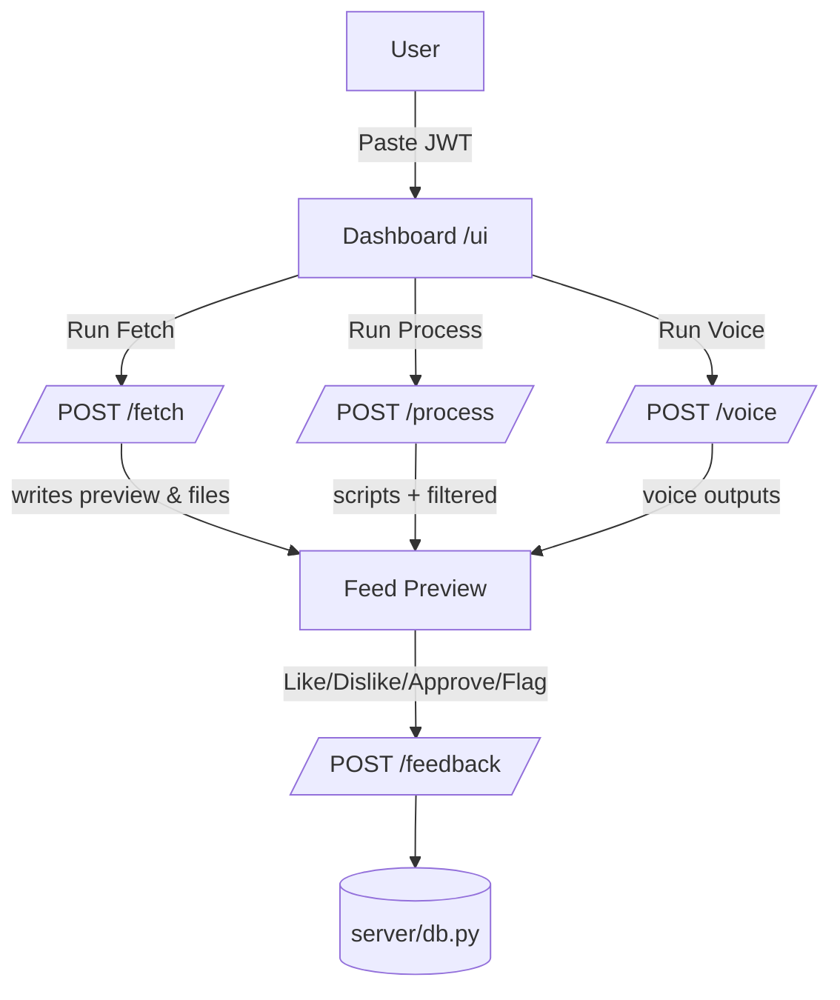

# News AI – Handover Documentation

## UI Flow Diagram


## API Mapping Table
| UI Element | Endpoint | Method | Request (key fields) | Response (key fields) |
|---|---|---|---|---|
| Run Fetch | `/fetch` | POST | `registry`, `category`, `limit_preview` | `status`, `count`, `preview[]`, `files.items` |
| Run Process | `/process` | POST | `registry`, `category`, `limit_preview` | `status`, `counts.filtered`, `counts.scripts`, `preview[]`, `files.filtered`, `files.scripts` |
| Run Voice | `/voice` | POST | `registry`, `category`, `voice` | `status`, `count`, `preview[]`, `files.voice` |
| Send Feedback | `/feedback` | POST | `user_id`, `article_id`, `action`, `timestamp`, `context` | `success`, `feedback_id`, `updated_relevance_score` |

Notes:
- All endpoints require `Authorization: Bearer <jwt>`.
- Feedback `action` accepted: `like`, `save`, `share`, `dislike`, `skip`. "Flag" maps to `skip` plus `context.reason = "flag"`.

## Integration Guide (Front + Back)
### Backend Setup
- Requirements: Python 3.10+, Windows/PowerShell recommended.
- Install deps and start server:
```
python -m venv .venv
.\.venv\Scripts\activate
pip install -r requirements.txt
python -m uvicorn server.app:APP --port 8000 --reload
```
- Generate a dev JWT:
```
$env:JWT_SECRET = "your_dev_secret"
python scripts/dev_jwt.py demo_user user --ttl 3600
```
- Copy the token and paste it into the UI header.

### Frontend Usage
- Open UI at `http://127.0.0.1:8000/ui/`.
- Paste JWT, set language/theme as needed.
- Click Run Fetch → Run Process → Run Voice.
- Use feedback buttons on cards to send rewards.

### Data Freshness & Error Handling
- Fetch returns a preview slice and total count; items are read from `single_pipeline/output/*_items.json`.
- Process runs filter + scripts and returns counts plus preview fields aligned to Noopur’s schema (`title`, `variants`, `tone`, `audience`, `lang`).
- Voice returns item count and preview from `*_voice.json`.
- Errors return `HTTP 500` with `{error, message}`; the UI shows a status bar message and retains last good preview.

### Voice Output Triggers
- Clicking Run Voice calls `/voice`, which invokes `run_voice(...)` and writes outputs under `single_pipeline/output/<registry>_voice.json`.
- The UI status shows the item count; you can inspect the file path from the response.

## End-to-End Test Procedure
1. Set `JWT_SECRET` and generate a dev token.
2. Start the server: `python -m uvicorn server.app:APP --port 8000 --reload`.
3. Open `/ui`, paste token, Run Fetch → Process → Voice.
4. Click Like/Dislike/Approve/Flag on a card; confirm events in the Live Feedback panel and server logs.
5. Optional: run `python scripts/e2e_loop_test.py` to validate the loop headlessly.

## Demo – 1 Minute Script
- Show UI header: paste JWT, toggle theme, select language.
- Click Run Fetch: explain Filter+Verify; show preview.
- Click Run Process: highlight Script stage; show tone/audience badges.
- Click Run Voice: confirm status count.
- Click feedback buttons: explain reward propagation; mention DB write.
- Close with next steps: cloud LLM integration and richer dedup.

## Repo Structure & Handoff
- UI: `server/static/` (`index.html`, `styles.css`, `app.js`).
- API: `server/app.py` (wrappers `/fetch`, `/process`, `/voice`, `/feedback`).
- Pipeline: `single_pipeline/*` (agents, CLI, outputs, RAG dedup, traces).
- Scripts: `scripts/dev_jwt.py`, `scripts/e2e_loop_test.py`.
- Tests: `tests/*` including `test_pipeline_chain.py`.

## Next Dev Tips
- Map language selector to category-specific processing if needed.
- Implement a dedicated verification stage endpoint when ready.
- If using Uniguru cloud, set `UNIGURU_BASE_URL`, `UNIGURU_TAG_PATH`, `UNIGURU_API_KEY` and remove `UNIGURU_PROVIDER=local`.